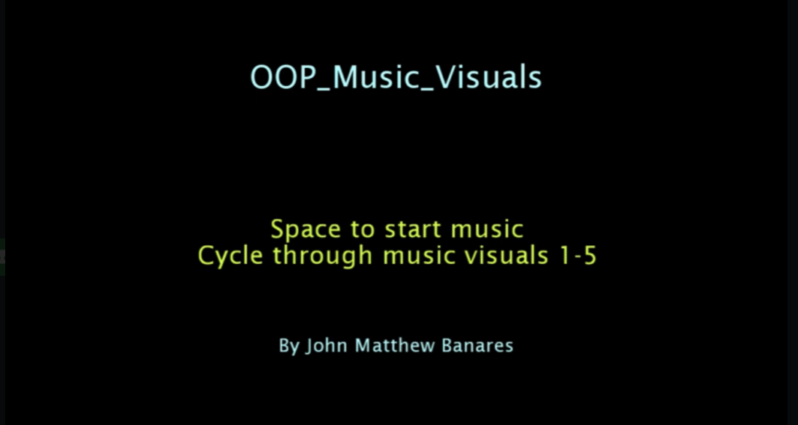
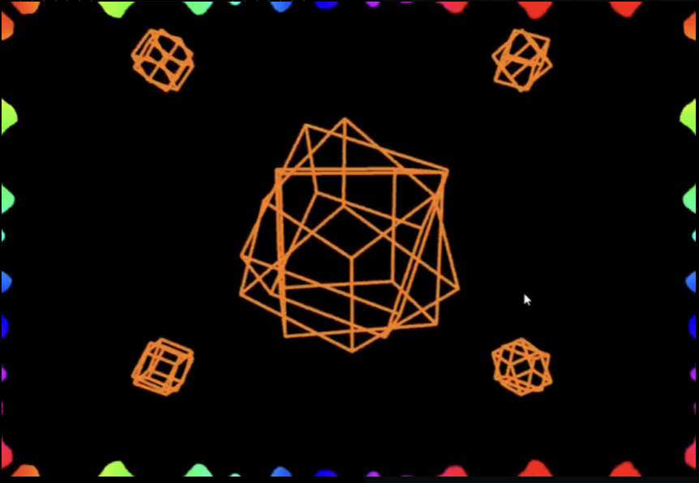
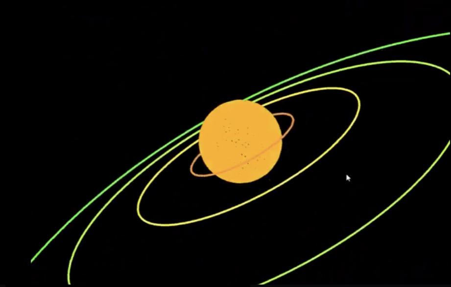
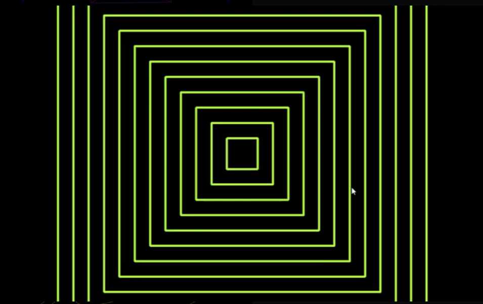
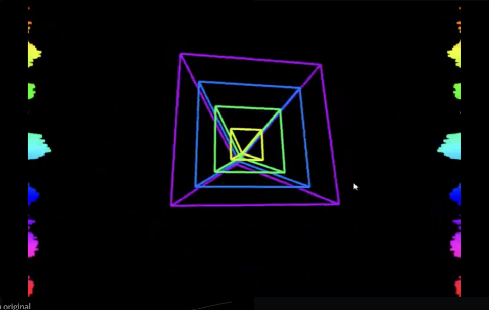
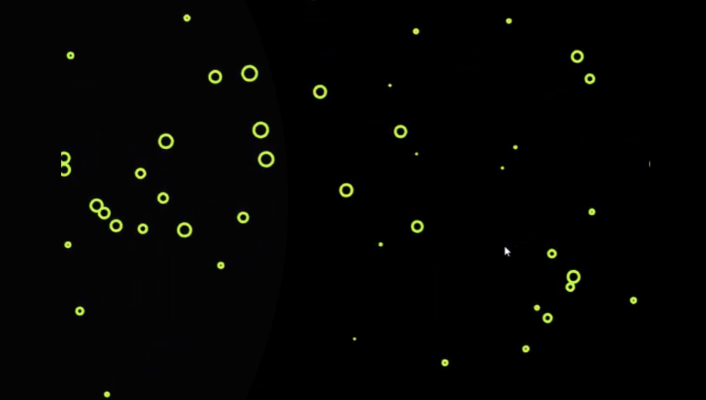

# Music Visualiser Project

Name:John Matthew Banares

Student Number: C20401442

# Description of the assignment
This assignment shows 6 different objects that react to the amplitude and frequency of music by changing sizes and colors.
# Instructions

1. Run the code, intro screen will show with instructions
2. Press space to start music
3. Cycle through visuals using keys 1-5
4. Visuals shown:
	- 1 = Cubes with waveform
	- 2 = Planet
	- 3 = Squares
	- 4 = Pyramid
	- 5 = LoopingCircle

# How it works

JohnMain extends Visual means that JohnMain is a subclass of Visual and has access to functions inside Visual functions such as getAudioBuffer, JohnMain inherits methods from Visual. Each visual is a class and created in JohnMain.

```Java
public class JohnMain extends Visual
{
    int mode;
    WaveForm wf;
    Cubes cv;
    Planet p;
    Sqaures sq;
    Pyramid pr;
    LoopingCircle[] loop_circle = new LoopingCircle[100];
    Intro in;
```
Objects created in setup:

```Java
public void setup()
{
	startMinim();

	// Call loadAudio to load an audio file to process 
	loadAudio("00. Feel.mp3");   

	wf = new WaveForm(this);
	cv = new Cubes(this);
	p = new Planet(this);
	sq = new Sqaures(this);
	pr = new Pyramid(this);

	for(int i = 0; i< loop_circle.length;i++)
	{
	    loop_circle[i] = new LoopingCircle(this);
	}

	in = new Intro(this);
}
```
Keypressed checks user input. Space plays music, "r" replays music, keys 1-5 is assigned to mode variable for switch case
```Java
 public void keyPressed()
{
	if (key == ' ')
	{
	    getAudioPlayer().play();
	}

	if (key == 'r')
	{
	    getAudioPlayer().cue(0);
	}

	if(key >='0' && key <='5')
	{
	    mode = key-'0';
	}
}
```
Each visual has a render method which displays it to the user. To cycle through each visual a switch case is used. For the last visual looping circles i had to do some research and watch a youtube video as i wanted to make a visual of many circles getting smaller as they were moving closer to the edge of the screen to make it seem like you're zooming, I came across a youtube video that had a tutorial of a starfield which was exactly what i was looking for. The video was very informative and took a while to understand how it works. 

```Java
 switch(mode)
{
    case 1:
    {
	//waveform and cubes
	wf.render();
	cv.render();
	break;
    }
    case 2:
    {
	//planet
	p.render();
	break;
    }
    case 3:
    {
	//squares
	sq.render();
	break;
    }
    case 4:
    {
	//pyramid
	pr.render();
	break;
    }
    case 5:
    {
        //make circle start from the center of the screen if commented out this is zooming in from the top left hand corner
	translate(width/2, height/2);
	//render and update 100 circles
	for(int i = 0; i< loop_circle.length;i++)
	{
	    loop_circle[i].update();
	    loop_circle[i].render();
	}
	break;
    }
    default:
    {
	in.render();
    }
}
```
# What I am most proud of in the assignment

Im most proud of the first visual i made the waveform with the cubes. At first i was not conifdent with java processing but after getting the first visual working properly the rest of the visuals were easier to make.

Intro.java:



Cubes.java and WaveForm.java:



Planet.java:



Sqaures.java:


Pyramid.java:


LoopingCircle.java:


# Youtube Video

[](https://www.youtube.com/watch?v=g3Eg3gjjCl8)
